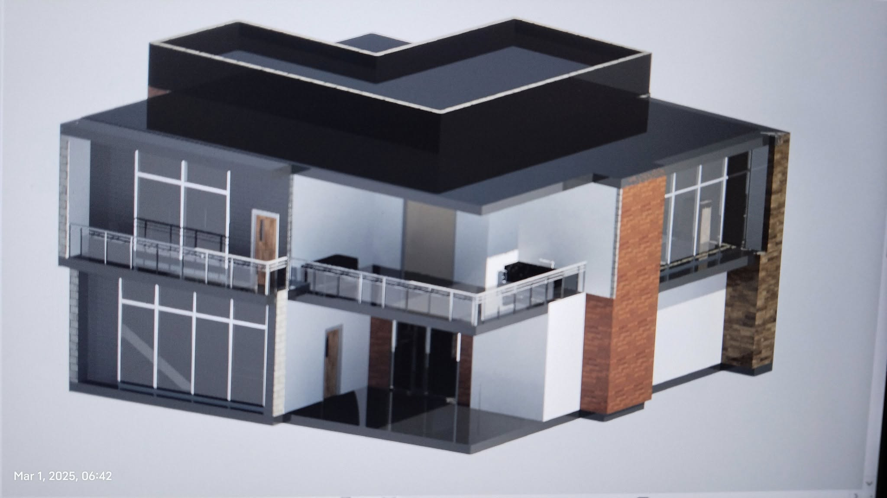

<h1 align="center"><font face="cursive">Hi, I'm Magdamit173! ~ 💻</font></h1>
<center>
<h3 align="center"><font face="cursive">"Aspiring to Master [REDACTED] and Perfecting the Art of Discovering New Since 2020" 💻✨</font></h3>

<hr>

<code>
Status: A former STEM Strand Student, Currently an ECE (Electronics And Communications Engineer) freshmen student 
</code>


<hr>


```javascript
Name: "Magdamit173".pseudonym()
```
```javascript
Age: `bmV3IERhdGUoMTE0NDI4MTYwMCAqIDEwMDAp`
```
```javascript
Loves: |Everything That Interest Me| "♡⸜(˃ ᵕ ˂ )⸝"
```
```java
Hobbys: "( • ᴖ • ｡) Discovering Something, Probably Electronics and Programming, Even If I'm Bad at Calculus."
```
### Languages And Tools: 
| Javascript | PHP | C# | Python |
|------------|-----|----|--------|
| Met Since 2020 | Partially Knows Since 2021 | Partially Knows Since 2022 | Met Since 2023 | 
| All programming languages have similar core concepts. | Each language shares common principles like variables and loops. | The main differences lie in syntax and libraries. | Understanding one language aids in learning others. |

<hr>


### Why Did I Choose to Code Instead of Joining Computer Science, Computer Engineering, or Information Technology?

Despite having a basic understanding of programming and limited experience (pretty humble XD), opportunities can be scarce when you join ComSci, IT, or CPE. You face more competition in the market and in how you sell yourself.

ECE is like a gateway where you just need to put your brain to work, and opportunities will come to you automatically.

If I acquire my ECE, it would be pretty impressive because who wouldn’t want an electronics expert and programmer on their side? Plus, when you're out of money, you can still find a job due to your diverse skills, etc.


<hr>