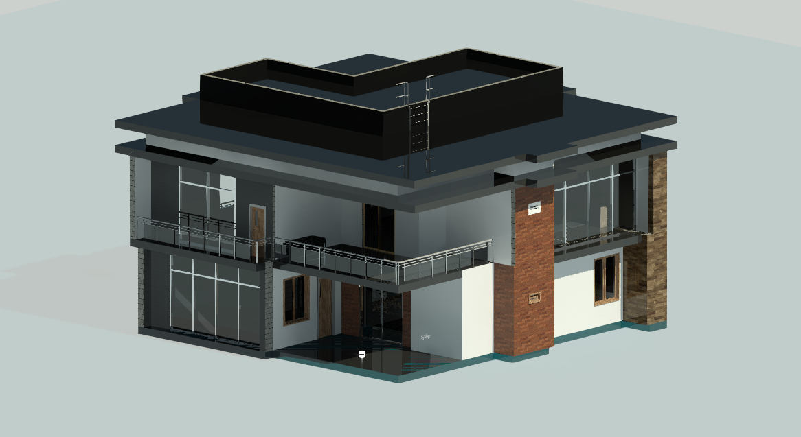

<h1 align="center"><font face="cursive">Hi, I'm Magdamit173! ~ 💻</font></h1>
<center>
<h2 align="center"><font face="cursive">Aspiring to Master All</font></h2>
<h4 align="center"><font face="cursive">Hardware-Bred, Code-Fed, Precision-Driven, Future-Led" 💻✨</font></h4>

<hr>

<code>
Status: A former STEM Strand Student, Currently an ECE (Electronics And Communications Engineer) 2nd year student 
</code>


<hr>


```javascript
Name: "Magdamit173".pseudonym()
```
```javascript
Age: ???
```
```javascript
Loves: |Everything That Interest Me| "♡⸜(˃ ᵕ ˂ )⸝"
```
```java
Hobbys: "( • ᴖ • ｡) Continual Discovery, Definitely Electronics and Programming, I Still Persist Even If Calculus is A Wall of Bricks."
```
### Languages And Tools: 
| Javascript | PHP | C# | Python |
|------------|-----|----|--------|
| Met Since 2020 | Partially Knows Since 2021 | Partially Knows Since 2022 | Met Since 2023 | 
| All programming languages have similar core concepts. | Each language shares common principles like variables and loops. | The main differences lie in syntax and libraries. | Understanding one language aids in learning others. |

<hr>

### <center> 🔧 Tools & IDEs </center>

<p align="center">
  
  
  
  
</p>

### <center> 🖌️ UI & Design </center>
<p align="center">
  
  
  
  
  
</p>

### <center> 🔌 Programming Languages & Frameworks </center>
<p align="center">
  
  
  
  
</p>

### <center> 🧪 Data Science & Scripting </center>

<p align="center">
  
  
  
  
  
</p>

### <center> ⚙️ DevOps & Backend </center>
<p align="center">
  
  
  
  
</p>

### <center> 🎮 Hardware, Game Dev & Embedded </center>
<p align="center">
  
  
  
</p>


<hr>

## My Public Repo Summary

<iframe width="600" height="600" src="https://vedantghodke.github.io/GitHub-Profile-Language-Percentage-Calculator/api.html?@Magdamit173" frameborder="0"></iframe>
