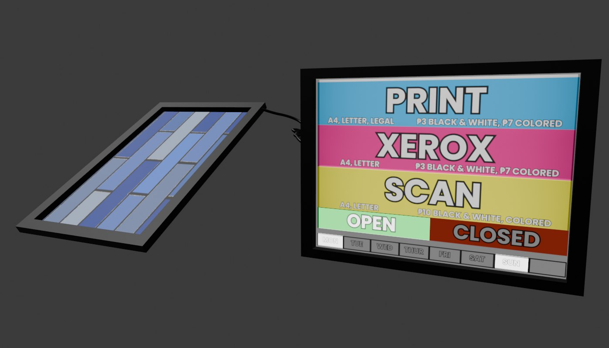

<h1 align="center"><font face="cursive">Hi, I'm Magdamit173! ~ 💻</font></h1>
<center>
<h3 align="center"><font face="cursive">"Aspiring to Master [REDACTED] and Perfecting the Art of Discovering New Since 2020" 💻✨</font></h3>


```javascript
Name: "Magdamit173".pseudonym()
```
```javascript
Age: `bmV3IERhdGUoMTE0NDI4MTYwMCAqIDEwMDAp`
```
```javascript
Loves: |Everything That Interest Me| "♡⸜(˃ ᵕ ˂ )⸝"
```
```java
Hobbys: "( • ᴖ • ｡) Discovering Something, Probably Electronics and Programming, Even If I'm Bad at Calculus."
```
### Languages And Tools: 
| Javascript | PHP | C# | Python |
|------------|-----|----|--------|
| Met Since 2020 | Partially Knows Since 2021 | Partially Knows Since 2022 | Met Since 2023 | 
| All programming languages have similar core concepts. | Each language shares common principles like variables and loops. | The main differences lie in syntax and libraries. | Understanding one language aids in learning others. |
